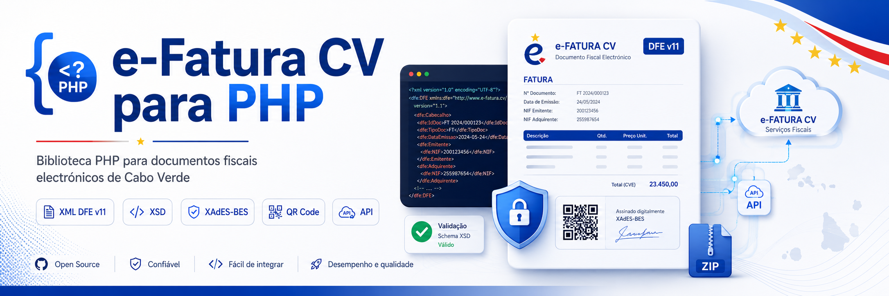

# e-Fatura CV para PHP

<p align="center">
  
</p>

[](https://github.com/Kowts/efatura-cv-php/actions/workflows/ci.yml)
[](https://www.php.net/)
[](LICENSE)
[](https://packagist.org/packages/kowts/efatura-cv)
[](https://intel.aikido.dev/packages/packagist/kowts/efatura-cv)


Biblioteca PHP independente de frameworks para validar documentos fiscais,
gerar XML DFE v11, validar com os XSD oficiais, assinar com XAdES-BES,
criar pacotes ZIP e comunicar com serviços e-Fatura de Cabo Verde.

> [!IMPORTANT]
> Este projecto não é oficial da DNRE. A utilização em produção exige
> homologação do software, credenciais válidas e testes nos ambientes oficiais.

## Funcionalidades

- nove tipos de documento: `FTE`, `FRE`, `TVE`, `RCE`, `NCE`, `NDE`, `DTE`, `DVE` e `NLE`;
- geração, validação e interpretação de IUD;
- validação de NIF, entidades, linhas, impostos e reconciliação de totais;
- emissão online e em contingência;
- geração de XML compacto DFE v11;
- ciclo de eventos `FDC` e `UDN`, incluindo XML, ZIP e submissão;
- validação com os XSD oficiais de 27 de Maio de 2024;
- assinatura XAdES-BES com RSA-SHA256;
- validação de certificados e correspondência da chave privada;
- pacotes ZIP Deflate com nomes `{IUD}.xml`;
- sequências e idempotência em memória ou transaccionais por PDO;
- submissão por middleware e directamente à plataforma;
- consultas fiscais, repetição segura e reconciliação através de PSR-18;
- cálculos monetários com representação decimal exacta;
- DFA em PDF com QR Code;
- DTOs imutáveis e tipados, sem retirar a API por arrays;
- integrações opcionais com Laravel, Symfony e Yii2;
- CLI para inspeccionar IUDs e validar XML;
- respostas JSON/XML normalizadas;
- nenhuma dependência de Laravel, Symfony ou outro framework.

## Fluxo de emissão

```mermaid
flowchart TD
    APP["Aplicação PHP<br/>Laravel · Symfony · Yii2 · PHP puro"]

    subgraph PREP["1. Preparação fiscal"]
        CONFIG["Configuração<br/>NIF, LED, software e ambiente"]
        MODE{"Emissão<br/>online?"}
        CONT["Dados de contingência<br/>IUC, motivo e data"]
        SEQ["Sequência PDO<br/>número fiscal sem duplicados"]
        IUD["IUD válido<br/>45 caracteres + controlo"]
    end

    subgraph DFE["2. Documento electrónico"]
        DOC["DTO ou array<br/>linhas, impostos e totais"]
        RULES{"Regras fiscais<br/>coerentes?"}
        XML["XML DFE v11<br/>namespace oficial"]
        XSD{"XML válido<br/>no XSD oficial?"}
        FIX["Corrigir dados<br/>antes de emitir"]
    end

    subgraph SEC["3. Segurança e pacote"]
        CERT["Certificado digital<br/>PEM ou PKCS#12"]
        CERTOK{"Certificado<br/>válido?"}
        SIGN["Assinatura<br/>XAdES-BES RSA-SHA256"]
        SIGOK{"Assinatura<br/>verificada?"}
        ZIP["ZIP Deflate<br/>{IUD}.xml"]
    end

    subgraph SEND["4. Entrega e acompanhamento"]
        ROUTE{"Canal de submissão"}
        MID["Middleware<br/>chave do transmissor"]
        PLATFORM["Plataforma e-Fatura<br/>OAuth + repositório"]
        RESULT["Resposta normalizada<br/>JSON/XML"]
        ACCEPTED{"Aceite pela<br/>autoridade?"}
        RECON["Idempotência<br/>e reconciliação"]
        UNCERTAIN["Estado incerto<br/>consultar antes de reenviar"]
        STORE["Guardar IUD, XML,<br/>ZIP e resposta"]
    end

    APP --> CONFIG --> MODE
    MODE -- "Sim" --> SEQ
    MODE -- "Não / offline" --> CONT --> SEQ
    SEQ --> IUD --> DOC --> RULES
    RULES -- "Não" --> FIX --> DOC
    RULES -- "Sim" --> XML --> XSD
    XSD -- "Não" --> FIX
    XSD -- "Sim" --> CERTOK
    CERT --> CERTOK
    CERTOK -- "Não" --> FIX
    CERTOK -- "Sim" --> SIGN --> SIGOK
    SIGOK -- "Não" --> FIX
    SIGOK -- "Sim" --> ZIP --> ROUTE
    ROUTE -- "Middleware" --> MID --> RESULT
    ROUTE -- "Plataforma" --> PLATFORM --> RESULT
    RESULT --> ACCEPTED
    ACCEPTED -- "Sim" --> STORE
    ACCEPTED -- "Não" --> RECON
    ACCEPTED -- "Sem resposta" --> UNCERTAIN --> RECON
    RECON --> STORE

    classDef app fill:#0f2f5f,stroke:#2f80ed,color:#fff,stroke-width:2px;
    classDef prep fill:#f8fafc,stroke:#3b82f6,color:#0f172a;
    classDef dfe fill:#fff7ed,stroke:#f97316,color:#0f172a;
    classDef sec fill:#ecfdf5,stroke:#10b981,color:#0f172a;
    classDef send fill:#f5f3ff,stroke:#8b5cf6,color:#0f172a;
    classDef decision fill:#111827,stroke:#facc15,color:#fff,stroke-width:2px;
    classDef warn fill:#fff1f2,stroke:#ef4444,color:#7f1d1d;
    classDef done fill:#ecfdf5,stroke:#059669,color:#064e3b,stroke-width:2px;

    class APP app;
    class CONFIG,CONT,SEQ,IUD prep;
    class DOC,XML dfe;
    class CERT,SIGN,ZIP sec;
    class MID,PLATFORM,RESULT,RECON,UNCERTAIN send;
    class MODE,RULES,XSD,CERTOK,SIGOK,ROUTE,ACCEPTED decision;
    class FIX warn;
    class STORE done;
```



## Requisitos

- PHP 8.1 ou superior;
- extensões `curl`, `dom`, `json`, `libxml`, `openssl` e `zip`.

## Instalação

```bash
composer require kowts/efatura-cv
```

Para instalar directamente do ramo de desenvolvimento, pode declarar o
repositório Git:

```json
{
    "repositories": [
        {
            "type": "vcs",
            "url": "https://github.com/Kowts/efatura-cv-php"
        }
    ],
    "require": {
        "kowts/efatura-cv": "dev-main"
    }
}
```

## Utilização rápida

```php
<?php

use Kowts\Efatura\Config\EfaturaConfig;
use Kowts\Efatura\Domain\DocumentType;
use Kowts\Efatura\Domain\Environment;
use Kowts\Efatura\Efatura;

$efatura = new Efatura(new EfaturaConfig(
    transmitterNif: '123456789',
    transmitterLed: '001',
    softwareCode: 'MEUSOFT',
    softwareName: 'Meu Software',
    softwareVersion: '1.0.0',
    middlewareBaseUrl: 'https://middleware.exemplo.cv',
    transmitterKey: getenv('EFATURA_TRANSMITTER_KEY') ?: null,
    defaultSerie: 'SER-F',
    emitter: [
        'taxId' => ['countryCode' => 'CV', 'value' => '123456789'],
        'name' => 'Empresa, Lda.',
        'address' => ['countryCode' => 'CV', 'addressDetail' => 'Praia'],
        'contacts' => ['email' => 'facturacao@exemplo.cv', 'telephone' => '2600000'],
    ],
    environment: Environment::Test
));

$invoice = $efatura->document()
    ->type(DocumentType::ElectronicInvoice)
    ->issueDate('2026-07-08')
    ->issueTime('10:30:00')
    ->receiver([
        'taxId' => ['countryCode' => 'CV', 'value' => '987654321'],
        'name' => 'Cliente',
    ])
    ->line([
        'quantity' => ['value' => 1, 'unitCode' => 'UN'],
        'price' => 1000,
        'priceExtension' => 1000,
        'netTotal' => 1000,
        'taxes' => [[
            'taxTypeCode' => 'IVA',
            'taxPercentage' => 15,
            'taxTotal' => 150,
        ]],
        'item' => [
            'description' => 'Serviço',
            'emitterIdentification' => 'SERV-1',
        ],
    ])
    ->totals([
        'priceExtensionTotalAmount' => 1000,
        'netTotalAmount' => 1000,
        'taxTotalAmount' => 150,
        'payableAmount' => 1150,
    ])
    ->validate();

$number = $efatura->nextDocumentNumber($invoice['issueDate'], $invoice['type']);
$iud = $efatura->buildIud($invoice['issueDate'], $invoice['type'], $number);
$xml = $efatura->buildDfeXml($iud, $invoice);

$xsd = $efatura->validateXml($xml);
if (!$xsd['valid']) {
    throw new RuntimeException(json_encode($xsd['errors'], JSON_THROW_ON_ERROR));
}

$signed = $efatura->signXml(
    $xml,
    file_get_contents('/segredos/certificado.pem'),
    file_get_contents('/segredos/chave-privada.pem'),
    getenv('EFATURA_KEY_PASSWORD') ?: null
);

$zip = $efatura->buildDfeZip([['iud' => $iud, 'xml' => $signed['xml']]]);
$result = $efatura->submitDfeZip($zip);
```

## Integração com Yii2

Instale também o Yii2 na aplicação consumidora:

```bash
composer require yiisoft/yii2
```

Registe o componente na configuração da aplicação:

```php
use Kowts\Efatura\Bridge\Yii2\EfaturaComponent;

return [
    'components' => [
        'efatura' => [
            'class' => EfaturaComponent::class,
            'config' => [
                'transmitter_nif' => '100200300',
                'transmitter_led' => '001',
                'software_code' => 'MEUSOFT',
                'software_name' => 'Meu Software',
                'software_version' => '1.0.0',
                'environment' => 'TEST',
            ],
        ],
    ],
];
```

Depois use a biblioteca sem duplicar regras fiscais:

```php
use Kowts\Efatura\Domain\DocumentType;

$iud = Yii::$app->efatura->buildSequentialIud('2026-07-08', DocumentType::ElectronicInvoice);
$xml = Yii::$app->efatura->buildDfeXml($iud, $documento);
```

## Sequências em produção

O armazenamento predefinido existe apenas em memória. Em produção, use uma
base de dados para impedir números duplicados entre processos:

```php
use Kowts\Efatura\Infrastructure\Sequence\PdoSequenceStore;

$pdo = new PDO('mysql:host=localhost;dbname=faturacao', 'utilizador', 'senha');
$sequences = new PdoSequenceStore($pdo);
$sequences->createTable(); // Execute uma vez, ou converta para uma migração.

$efatura = new Efatura($config, $sequences);
```

A sequência é independente por NIF transmissor, ano, LED e tipo documental.
Guarde sempre o IUD, XML, ZIP e resposta de transporte. Uma falha de rede não
autoriza a reutilização ou substituição automática do número fiscal.

## Segurança

- nunca envie chaves, certificados, tokens ou credenciais para o navegador;
- não guarde segredos no repositório;
- valide o certificado antes da emissão;
- use TLS e armazenamento cifrado;
- registe respostas técnicas sem expor dados pessoais ou segredos;
- fixe uma versão exacta do pacote em sistemas de produção.

Consulte [Assinatura e certificados](docs/assinatura.md) e
[Segurança](SECURITY.md).

## Documentação

- [Arquitectura](docs/arquitectura.md)
- [Referência da API](docs/api.md)
- [Conformidade](docs/conformidade.md)
- [Assinatura e certificados](docs/assinatura.md)
- [Guia de produção](docs/guia-producao.md)
- [Emissão em contingência](docs/contingencia.md)
- [Laravel, Symfony e Yii2](docs/frameworks.md)
- [Lançamentos e verificação](docs/lancamentos.md)
- [Exemplos completos](examples/README.md)
- [Exemplo em PHP puro](examples/invoice.php)
- [Exemplos dos tipos documentais](examples/document-types.php)
- [Contribuir](CONTRIBUTING.md)

## Estado do projecto

O pacote está em desenvolvimento activo. Os XSD oficiais estão incluídos, mas
não foram publicados vectores oficiais para comparar byte a byte IUD, ZIP e
assinaturas. Os testes internos não devem ser confundidos com certificação
oficial.

## Créditos

O desenho foi inspirado por
[`@akira-io/efatura`](https://github.com/akira-io/node-efatura), distribuído
sob MIT/Apache-2.0. Os XSD incluídos são os artefactos do sistema e-Fatura de
Cabo Verde.

## Licença

[MIT](LICENSE) © 2026 Kowts.
