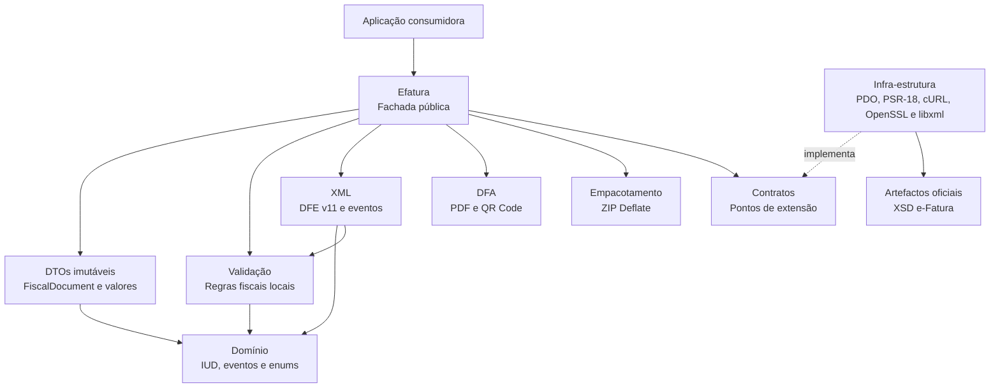
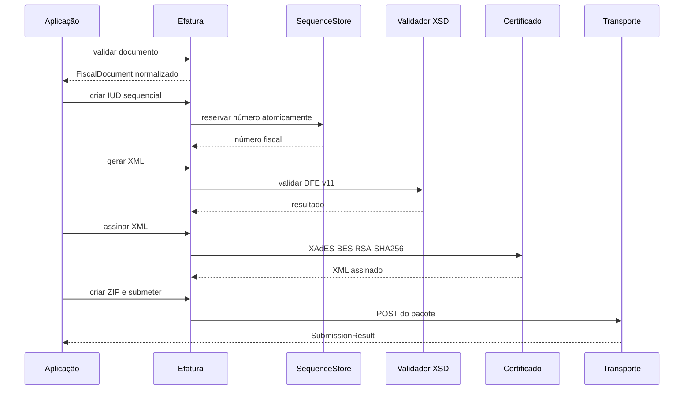

# Arquitectura

O pacote segue dependências orientadas para o domínio:

## Directórios

- `src/Domain`: tipos fiscais, IUD e identificadores de eventos;
- `src/Domain/Data`: DTOs imutáveis usados na API tipada;
- `src/Validation`: regras locais aplicadas antes do XML;
- `src/Xml`: serialização compacta na ordem exigida pelo XSD;
- `src/Dfa`: representação gráfica do documento em PDF;
- `src/Contract`: pontos de extensão;
- `src/Infrastructure`: PDO, HTTP, XSD e assinatura;
- `src/Bridge`: integrações opcionais com Laravel e Symfony;
- `src/Packaging`: pacote ZIP;
- `resources/xsd`: artefactos oficiais;
- `tests`: testes de domínio, XSD, ZIP, persistência e criptografia.

Uma aplicação pode substituir qualquer transporte, armazenamento de sequência
ou assinador através dos contratos do construtor de `Efatura`.

## Decisões

Os documentos podem entrar como arrays normalizados ou como DTOs imutáveis.
A API por arrays facilita a integração com formulários, filas, ORM e APIs; os
DTOs dão garantias de tipo a aplicações que as pretendam. Nenhuma das opções
depende de um framework. Tipos com um conjunto fechado de valores usam `enum`.

Geração, validação, assinatura, empacotamento e envio são operações separadas.
Esta separação permite guardar cada artefacto e recuperar de falhas sem alterar
o número fiscal.

## Ciclo de emissão

A reserva do número acontece antes da comunicação externa. A aplicação deve
persistir o IUD, o XML assinado, o ZIP e a resposta para poder reconciliar uma
falha sem reutilizar a numeração.
