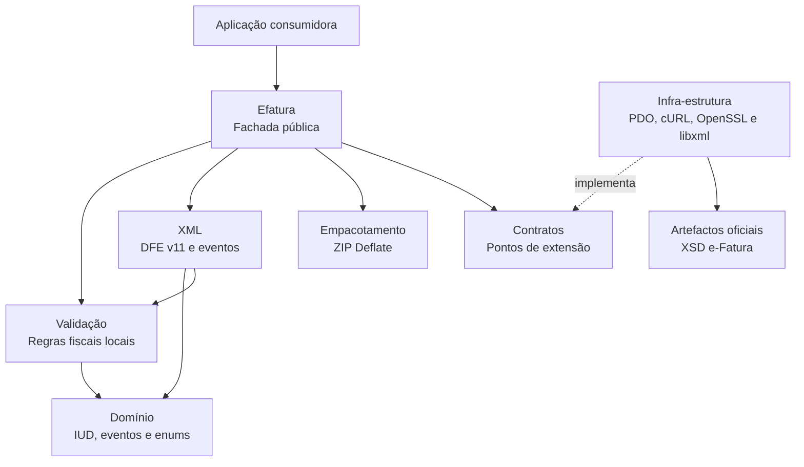

# Arquitectura

O pacote segue dependências orientadas para o domínio:

## Directórios

- `src/Domain`: tipos fiscais, IUD e identificadores de eventos;
- `src/Validation`: regras locais aplicadas antes do XML;
- `src/Xml`: serialização compacta na ordem exigida pelo XSD;
- `src/Contract`: pontos de extensão;
- `src/Infrastructure`: PDO, HTTP, XSD e assinatura;
- `src/Packaging`: pacote ZIP;
- `resources/xsd`: artefactos oficiais;
- `tests`: testes de domínio, XSD, ZIP, persistência e criptografia.

Uma aplicação pode substituir qualquer transporte, armazenamento de sequência
ou assinador através dos contratos do construtor de `Efatura`.

## Decisões

Os documentos são arrays normalizados. Isso evita impor DTOs de um framework e
permite receber dados de formulários, filas, ORM ou APIs. Tipos com um conjunto
fechado de valores usam `enum`.

Geração, validação, assinatura, empacotamento e envio são operações separadas.
Esta separação permite guardar cada artefacto e recuperar de falhas sem alterar
o número fiscal.
