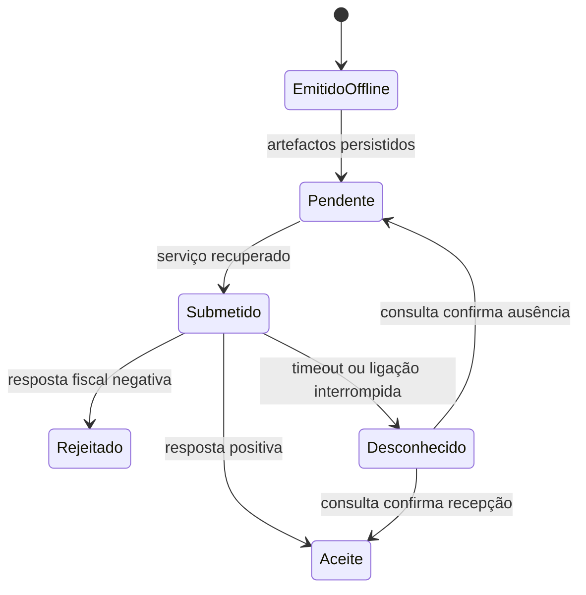

# Emissão em contingência

A contingência serve para manter a operação quando a comunicação não está
disponível. Não deve ser usada para contornar rejeições fiscais ou validações.

## Procedimento

1. Confirme e registe a indisponibilidade do serviço.
2. Reserve a numeração normal, sem criar uma série paralela improvisada.
3. Gere o documento com `EmissionMode::Offline` ou `EmissionMode::Off`.
4. Entregue o DFA ao cliente com a indicação de contingência.
5. Guarde IUD, XML assinado, PDF, motivo, instante e operador.
6. Quando o serviço recuperar, submeta os mesmos artefactos.
7. Reconcilie a resposta e encerre o incidente.

```php
use Kowts\Efatura\Domain\EmissionMode;

$xml = $efatura->buildDfeXml(
    $iud,
    $document,
    EmissionMode::Offline
);
```

## Regras de recuperação

- nunca reutilize um número reservado;
- nunca altere silenciosamente um XML já entregue ao cliente;
- um timeout deixa o estado desconhecido, não automaticamente pendente;
- preserve a ordem cronológica de submissão sempre que o serviço o permita;
- documente qualquer correcção por meio do documento ou evento fiscal adequado;
- respeite o prazo fiscal configurado para documentos de contingência.



Os limites temporais implementados pela biblioteca devem ser confrontados com
as regras oficiais vigentes no momento da homologação.
