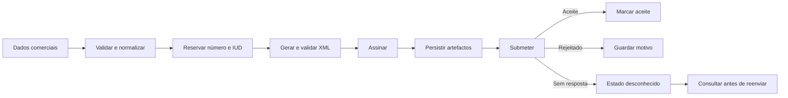

# Guia de utilização em produção

Este guia descreve responsabilidades operacionais que ficam na aplicação
consumidora. A biblioteca valida, assina, empacota e transmite documentos, mas
não substitui a homologação oficial nem a política de arquivo da organização.

## Lista de verificação

- software e emitente homologados no ambiente utilizado;
- relógio do servidor sincronizado e fuso horário configurado;
- sequência fiscal numa base de dados partilhada;
- certificado válido, com acesso limitado ao processo de emissão;
- credenciais obtidas por variáveis de ambiente ou gestor de segredos;
- timeouts e política de repetição definidos no cliente HTTP;
- IUD, XML, ZIP, resposta e estado fiscal guardados de forma durável;
- logs sem chaves, tokens, documentos completos ou dados pessoais;
- alertas para certificados próximos da expiração e submissões rejeitadas;
- cópias de segurança e procedimento testado de recuperação.

## Fluxo recomendado



Um timeout não prova que o servidor recusou o pacote. Trate-o como estado
desconhecido e confirme o estado fiscal antes de autorizar um reenvio.

As falhas de transporte lançadas pela fachada são convertidas em
`SubmissionUncertainException`. Para consultas `GET`, pode envolver o cliente
PSR-18 com `RetryingPsr18Client`; este aplica espera exponencial e respeita
`Retry-After`, mas nunca repete um `POST`.

```php
use Kowts\Efatura\Fiscal\ReconciliationStatus;
use Kowts\Efatura\Fiscal\SubmissionReconciler;
use Kowts\Efatura\Infrastructure\Http\RetryingPsr18Client;

$http = new RetryingPsr18Client($psr18Client);
$fiscalClient = new Psr18FiscalAuthorityClient($http, $requestFactory, $baseUrl);
$reconciliation = (new SubmissionReconciler($fiscalClient))
    ->reconcile($iud, $accessToken);

if ($reconciliation->status === ReconciliationStatus::Confirmed) {
    // Arquivar a confirmação e não reenviar.
}
```

## Sequência persistente

A implementação PDO suporta SQLite, MySQL/MariaDB, PostgreSQL e SQL Server.
Consulte [Persistência PDO](persistencia-pdo.md) para a matriz completa de
motores, esquemas de tabelas e recomendações de concorrência.

```php
use Kowts\Efatura\Efatura;
use Kowts\Efatura\Infrastructure\Sequence\PdoSequenceStore;
use Kowts\Efatura\Infrastructure\Submission\PdoSubmissionRegistry;

$pdo = new PDO(
    getenv('DATABASE_DSN') ?: '',
    getenv('DATABASE_USER') ?: null,
    getenv('DATABASE_PASSWORD') ?: null,
    [PDO::ATTR_ERRMODE => PDO::ERRMODE_EXCEPTION]
);

$sequences = new PdoSequenceStore($pdo);
$submissions = new PdoSubmissionRegistry($pdo);
$efatura = new Efatura(
    $config,
    $sequences,
    submissionRegistry: $submissions
);
```

Converta `PdoSequenceStore::createTable()` e
`PdoSubmissionRegistry::createTable()` em migrações controladas. Não as
execute em cada pedido HTTP. O ambiente `PRODUCTION` recusa deliberadamente os
armazenamentos em memória.

## Certificados

O formato PKCS#12 pode ser carregado sem criar ficheiros PEM temporários:

```php
$credentials = $efatura->loadPkcs12(
    file_get_contents(getenv('EFATURA_PKCS12_PATH') ?: ''),
    getenv('EFATURA_PKCS12_PASSWORD') ?: ''
);

$check = $efatura->validateCertificate(
    $credentials['certificate'],
    $credentials['privateKey']
);

if (!$check['valid']) {
    throw new RuntimeException(implode('; ', $check['issues']));
}
```

Não inclua certificados privados, palavras-passe ou respostas fiscais completas
em relatórios de erro.

## Idempotência

O registo incluído por omissão existe em memória e protege apenas a instância
PHP actual. Use `PdoSubmissionRegistry` ou implemente `SubmissionRegistry`
sobre outro armazenamento partilhado.

## Ambientes

Use `Environment::Test` durante desenvolvimento e homologação. Só seleccione o
ambiente de produção depois de confirmar URLs, credenciais, certificado,
software e emitente. Nunca copie respostas de teste para o arquivo fiscal de
produção.
